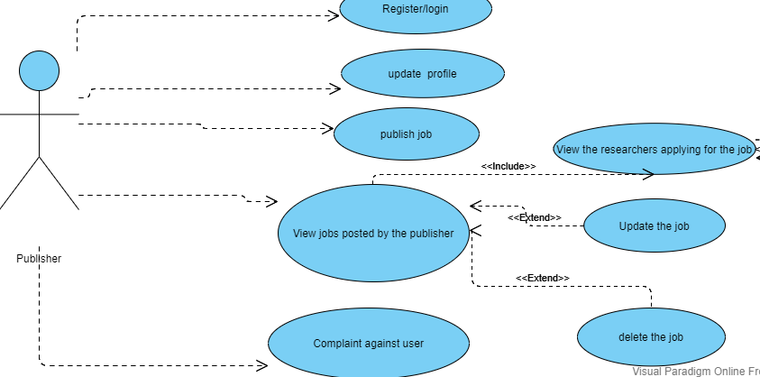

# Job Offers Website
> asp.net mvc with entity framework codefirst
## Table of contents
* [General info](#general-info)
* [Screenshots](#screenshots)
* [Technologies](#technologies)
* [Setup](#setup)
* [Features](#features)
* [Status](#status)
* [Inspiration](#inspiration)
* [Contact](#contact)

## General info
In this site project, we can post many jobs through the publisher's account and apply for many jobs through a researcher's account, and we can also manage the site through an account admin
## Screenshots

## Technologies
* Tech 1 - version 1.0
* Tech 2 - version 2.0
* Tech 3 - version 3.0

## Setup
Describe how to install / setup your local environement / add link to demo version.

## Code Examples
Show examples of usage:
`put-your-code-here`

## Features
List of features ready and TODOs for future development
* Awesome feature 1
* Awesome feature 2
* Awesome feature 3

To-do list:
* Wow improvement to be done 1
* Wow improvement to be done 2

## Status
Project is: _in progress_, _finished_, _no longer continue_ and why?

## Inspiration
Add here credits. Project inspired by..., based on...

## Contact
Created by [@flynerdpl](https://www.flynerd.pl/) - feel free to contact me!
