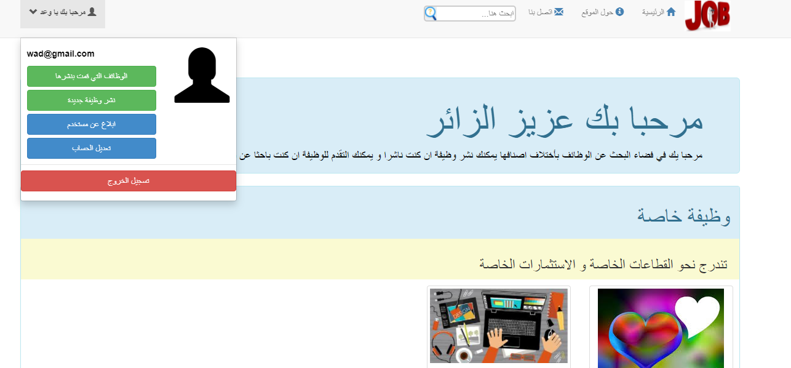

# Job Offers Website
> asp.net mvc with entity framework codefirst
## Table of contents
* [General info](#general-info)
* [Screenshots](#screenshots)
* [Technologies](#technologies)

* [Features](#features)

## General info
In this site project, we can post many jobs through the publisher's account and apply for many jobs through a researcher's account, and we can also manage the site through an account admin
## Screenshots
* researcher usecase diagram

* publisher usecase digram

* admin usecase diagram

* Database diagram greated from entity framework codefirst

## Technologies
 I use in this project asp.net.identity for authentication and authorization ,,also use linq ,,,vishual studio 2019

## Features

* screenshot for Admin Account

* screenshot for researcher Account

* screenshot for publisher Account

## Contact
Created by [@flynerdpl](https://www.flynerd.pl/) - feel free to contact me!
